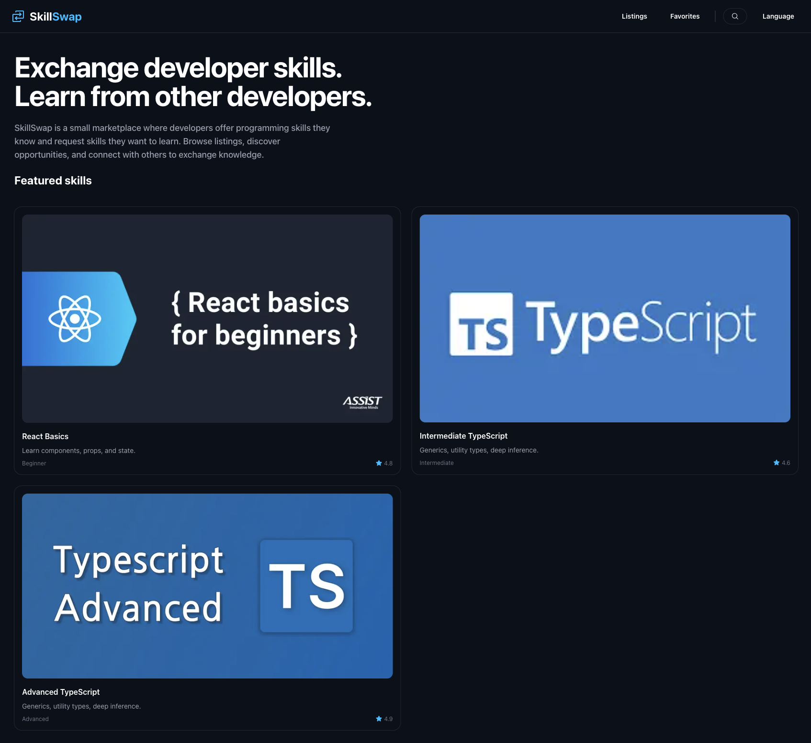
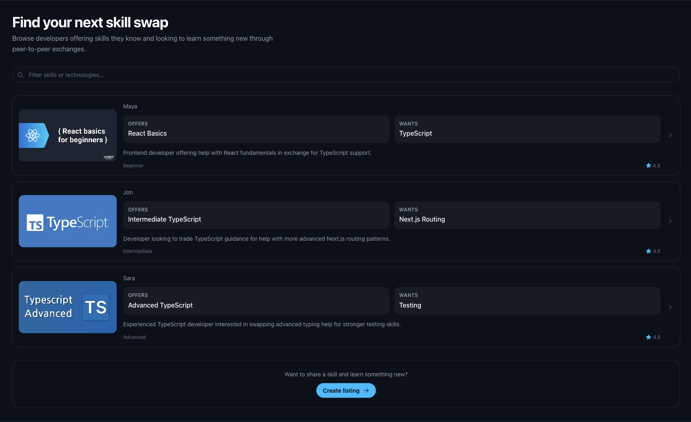
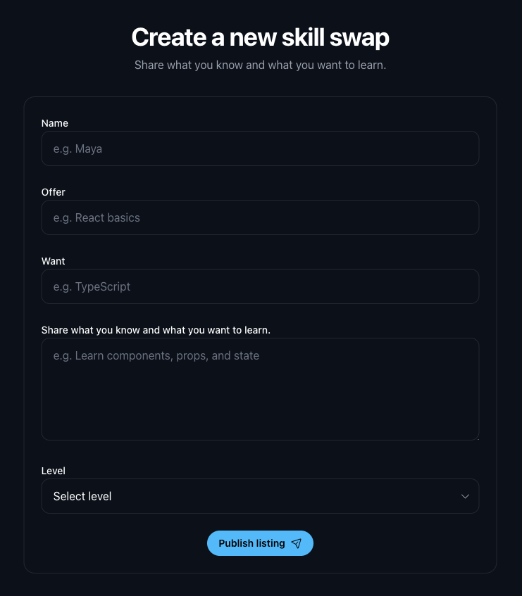

# SkillSwap

A small Next.js app for exchanging skills between users.

The goal of this project is to practice building a clear, structured, and honest UI. Every visible action does something real, and nothing is over-engineered.

It focuses on making deliberate trade-offs and building a consistent front-end system rather than a feature-heavy product.

---

## Preview



## More views

### Listings



### Create listing



---

## Features

- Browse skill listings
- Filter listings in real time
- View listing details
- Create a new listing (local form)
- Mark listings as favorites (local state)
- Basic localization (English / Norwegian)
- Custom not-found handling for invalid routes

---

## What this project focuses on

- Simple and predictable routing (Next.js App Router)
- Clear and maintainable component structure
- Consistent UI patterns across pages
- Avoiding unnecessary abstraction
- UI that reflects real functionality (no fake actions or flows)

---

## What this project does not include

- No backend or database
- No authentication
- No real search engine or API
- No persistence beyond local state

These limitations are intentional.  
The focus is on front-end structure, state management, and user experience, not full product complexity.

---

## Tech stack

- Next.js (App Router)
- React
- TypeScript
- Tailwind CSS

---

## Getting started

Install dependencies and run the development server:

```bash
npm install
npm run dev
```

Then open http://localhost:3000

## Notes

This project is intentionally small and focused.
It prioritizes clarity, consistency, and maintainability over feature completeness.

## Future improvements

- Persist listings with a backend
- Add authentication
- Improve accessibility and keyboard navigation
